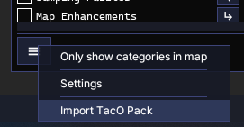
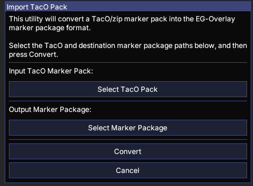
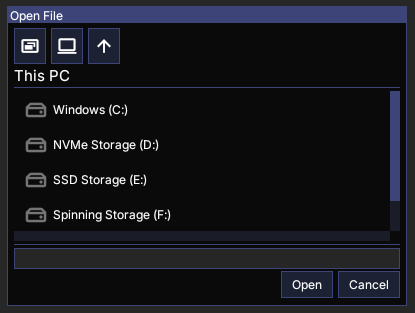
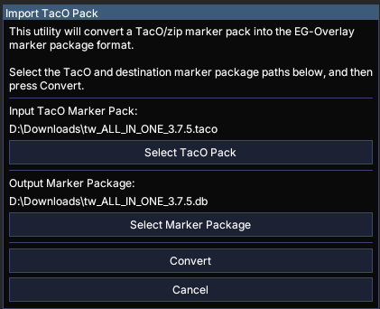
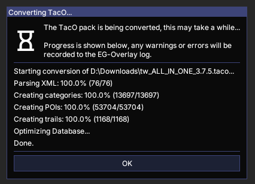
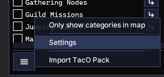
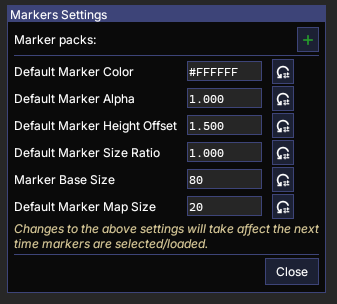
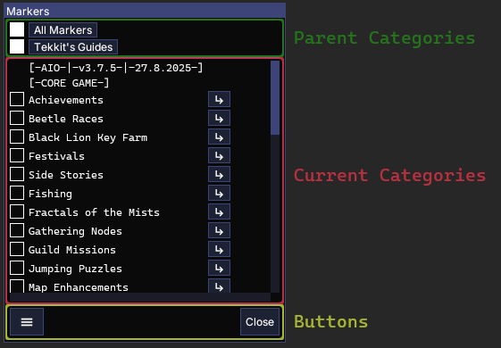

.. EG-Overlay
.. Copyright (c) 2025 Taylor Talkington
.. SPDX-License-Identifier: MIT

Markers
=======

.. overlay:module:: markers

The markers module manages and displays in game markers that are displayed in
the 3D scene and can be used to help guide the player through the GW2 world.

.. toctree::
    :hidden:
    :caption: Marker Pack Development
    :maxdepth: 1

    markerpacks

.. toctree::
    :hidden:
    :caption: Submodules
    :maxdepth: 1

    package
    data

Terminology
-----------

While users of BlishHUD, TacO, and other overlays should be familiar with the
terms used below, including the name of this module ('markers'), the following
terms are documented to remove any ambiguity.

:Category: A category is a grouping of markers, trails, and even other
           categories.

           Categories are analogous to file system folders. Every marker or
           trail must exist in a category. Markers and trails are generally
           managed by the category (i.e. an entire category is shown or hidden).

:Marker: A marker represents a single point within the GW2 world. TacO users may
         call markers POIs.

:Trail: A trail represents a path along multiple points within the GW2 world.

.. _markers-quick-start:

Quick Start
-----------

Most of the markers module functionality can be controlled from the Category
Manager window.

The Category Manager can be shown by selecting the 'Marker's item in the
EG-Overlay menu, which can be shown by pressing ``ctrl-shift-e`` by default.

.. seealso::

    See the :overlay:module:`overlay-menu` module for more details on the
    overlay menu.

Importing TacO Marker Packs
~~~~~~~~~~~~~~~~~~~~~~~~~~~

The markers module uses its own marker package format, but popular TacO marker
packs can be imported.

.. seealso::

    See :doc:`markerpacks` for details on the EG-Overlay Marker Package format.

First, open the Category Manager as described above, then click the menu button
on the bottom of the window and select 'Import TacO Pack':

This will open the TacO Import Wizard:

Click 'Select TacO Pack' to select the TacO pack to import. This will open an
Open File dialog:

Navigate to the TacO pack file and click 'Open.'

.. tip::

   The two buttons at the top of the Open File dialog next to the 'Up' button
   will navigate to the Desktop and This PC.

Once a TacO pack is selected both the 'Input Taco Marker Pack' and
'Output Marker Package' values will be updated.

The 'Output Marker Package' will be chosen automatically based on the path of
the input TacO pack. You can change it by clicking 'Select Marker Package.'

Once both input and output files are selected, click 'Convert.' This will close
the wizard window an open a new window that shows the progress of the conversion.

Once the conversion is complete, click the 'OK' button to close the window.

Adding Marker Packages
~~~~~~~~~~~~~~~~~~~~~~

Marker packages that have been converted or downloaded can be added in the
settings window.

Open the settings window by selecting 'Settings' from the Category Manager
window menu:

This will open the settings window:

Marker packages can be added by clicking the green '+' next to 'Marker packs'
and using the Open File dialog to navigate to the maker package file.

Multiple marker packages can be added by repeating this process. Marker packages
can later be removed by clicking the red '-' next to the package in the settings
window.

.. warning::

   Once a marker package is added or removed the Category Manager window will
   automatically update, and any active markers in the newly added package will
   be loaded.

   Most marker packs default all categories to active, meaning that all markers
   in the current map will be loaded whenever a new marker package is added for
   the first time.

   When this occurs, it may take several seconds for the loading to complete,
   but the overlay including the Category Manager window should still be usable.

   Once all of the markers have been loaded all categories except those that
   you wish to be displayed can be turned off.

Once all marker packs have been added, click 'Close' to close the settings
window.

Category Manager
----------------

The Category Manager allows the user to control what categories, and therefore
which markers and trails, are visible.

Since categories may be arranged in a complex hierarchy, the Category Manager
window allows the user to navigate to different categories, similar to a file
folder structure.

The Category Manager window is made up of 3 sections:

Parent Categories
~~~~~~~~~~~~~~~~~

The Category Manager can be navigated to a parent category by clicking on the
corresponding button in the parent categories section of the window. The
'All Markers' category is a root category that always exists and will display
all root categories from all marker packages.

Visibility of parent categories, including 'All Markers' can be controlled by
toggling the check box next to the corresponding category button.

Current Categories
~~~~~~~~~~~~~~~~~~

The main section of the window displays the current categories, those that are
the direct children of the last category in the Parent Categories section.

Category visibility can be controlled by toggling the check box next to the
corresponding category name.

The children of a category can be viewed by navigating to it, by pressing the
arrow button next to the corresponding category name.

Buttons
~~~~~~~

The Category Manager window has two buttons: menu and Close.

The menu button shows a menu that allows the user to select if only categories
with markers or trails in the current map should be shown, the settings window,
and the TacO Pack import wizard.

The Close button closes the Category Manager.
